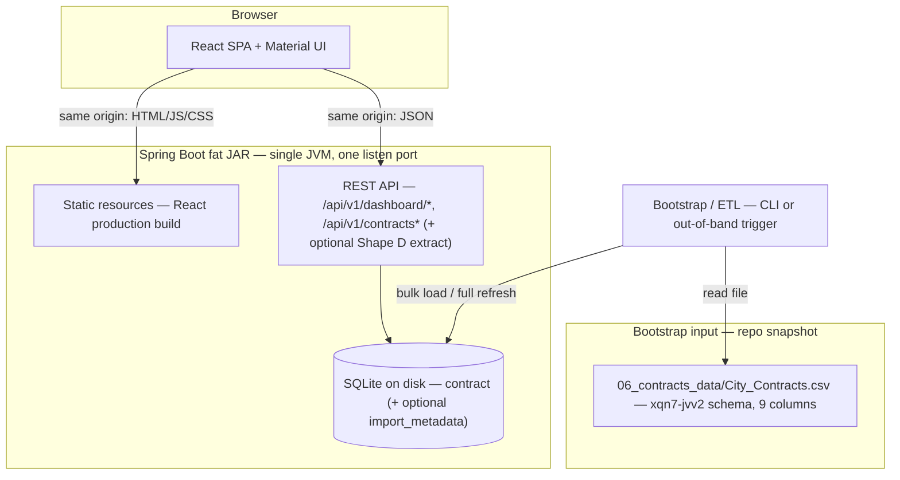

# Shape C — Contract Expiry Dashboard

## Technical Design Document (no application code)

**Stack:** React, Material UI, SQLite, Spring Boot REST API  
**Packaging:** Single Spring Boot process serving REST API and static React assets; deployable as one fat JAR  
**Data source:** City Contracts fields match Richmond open data `xqn7-jvv2` (nine columns). **Bootstrap upload** for this MVP reads the repository snapshot `06_contracts_data/City_Contracts.csv` (path relative to `pillar-thriving-city-hall`); refresh that file from the portal's CSV export when you need a newer cut — not the SODA API for ingest.  
**MVP constraints:** Advisory-only tool; staff verify in official systems; localhost demo; no authentication  

---

## 1. Purpose and scope

Internal-facing dashboard for procurement staff to see **upcoming contract end dates** by **department**, by **mutually exclusive renewal window**, and in a **sortable, paginated table**, with **cross-chart filtering** and **contract detail** in a dialog. One CSV row equals one contract row in the UI and database.

### 1.1 Combined application (Shapes C + D)

The **reference implementation** ships **one SPA** in the same Spring Boot fat JAR: a **tabbed shell** with **Contract Pulse View** (this document, default selected) and **Document Insight Extractor** (Shape D — upload PDF, extract structured fields via Gemini). Shape C **REST** paths and behavior are unchanged when Shape D is present; Shape D adds separate endpoints (see `07_mvp_doc/shape_d_pdf_contract_extractor_tdd.md`). **Clear all filters** applies only to Shape C state.

---

## 2. Architecture




- **Runtime:** The browser loads the SPA from the same origin as the API. Only Spring Boot listens on a port (e.g. 8080).
- **Data load:** `06_contracts_data/City_Contracts.csv` is ingested into SQLite **before** or **outside** normal request handling (CLI bootstrap or admin-only trigger); the API is **read-heavy** against SQLite for MVP.
- **Shape D coexistence (optional):** The same process may expose `POST /api/v1/extract/contract-pdf` and static assets for the extractor tab; that path does **not** read SQLite contract rows and is specified in the Shape D TDD.

---

## 3. Renewal-window semantics (locked)

### 3.1 Reference date

- **Reference date** = **server local date** at request handling time (beginning-of-day in the server’s default timezone, documented in deployment notes). No fixed “as of” demo date for MVP.

### 3.2 Day-until-end calculation

For each row with a **parsed effective end date** `effective_to`:

`days_until = effective_to_date - reference_date` (calendar-day difference; same definition used API-wide and in bootstrap validation logs).

### 3.3 Mutually exclusive buckets (renewal / bar chart scope only)

The **bar chart** and the `**renewalBucket` filter** use **only** the categories below. They answer: “Among contracts we are tracking for **forward-looking** renewal windows or **unknown** end dates, how many fall in each slice?”

Each contract that is **eligible for the bar** (see §3.4) falls into **exactly one** of:


| Bucket key (API) | Meaning                                      |
| ---------------- | -------------------------------------------- |
| `DAYS_0_30`      | `0 <= days_until <= 30`                      |
| `DAYS_31_60`     | `31 <= days_until <= 60`                     |
| `DAYS_61_90`     | `61 <= days_until <= 90`                     |
| `DAYS_91_180`    | `91 <= days_until <= 180`                    |
| `DAYS_181_PLUS`  | `days_until >= 181`                          |
| `UNKNOWN_END`    | No reliable parsed `effective_to` (see §3.5) |


### 3.4 Past end date (`PAST_END_DATE`) — table only (option 6)

If `effective_to` is parsed and `effective_to_date < reference_date`, then `days_until < 0`. These rows are **past-due** relative to the reference date.

- **Bar chart:** **Omit entirely.** No bar, no count, no click target for past-due.
- `**renewalBucket` query parameter / chart filter:** **Not applicable.** No `PAST_END_DATE` bucket key in the API for chart-driven filtering.
- **Pie chart:** When **no** `renewalBucket` filter is active, department counts **include** past-due rows. When a `renewalBucket` filter **is** active, past-due rows **do not** match any bucket and therefore **drop out** of the pie (consistent with AND logic).
- **Table:** Past-due rows are **always in the dataset** for the table unless explicitly hidden by a table-only control (see §5.3). Staff surface them via **table affordances**, not the bar.

**Implication:** The **sum of bar segment counts** equals the number of contracts that are either `**UNKNOWN_END`** or have `**days_until >= 0**` (within the current department filter if any). It does **not** equal total portfolio count; **past-due** volume appears only in the **table** (and in the **pie** when no renewal filter is applied).

### 3.5 Unknown / missing end date

If `effective_to` is **null** after ingest (missing, blank, or unparseable — see ingest rules), the row is assigned:


| Bucket key    | Meaning                     |
| ------------- | --------------------------- |
| `UNKNOWN_END` | No reliable parsed end date |


**Bar chart** includes `UNKNOWN_END` so forward-looking and unknown-end counts reconcile with `**renewalBucket`** filtering; **past-due** is out of scope for the bar (§3.4).

### 3.6 Ingest rules (effective dates)

- Store **raw** source strings alongside **normalized** parsed dates where possible.
- Rows that fail **only** end-date parsing: still loaded; `effective_to` parsed column null → `UNKNOWN_END` for chart/filter purposes.
- Date normalization expectations align with Shape C: inconsistent source formatting is handled in ETL; skipped rows are an exception (see operational notes).

---

## 4. Filter model (locked)

### 4.1 Dimensions

1. **Department filter** — set by clicking a **pie** segment; value is the **department label** (or stable surrogate if introduced later; MVP may use normalized text from `agency_department`).
2. **Renewal bucket filter** — set by clicking a **bar**; value is one of `**DAYS_0_30` … `DAYS_181_PLUS`** or `**UNKNOWN_END**` (§3.3). Past-due is **not** selectable here (§3.4).
3. **Table end-date scope** — set only via table toolbar (§5.3); values align with `endDateScope` on `GET /api/v1/contracts`. Combines with **department** and `**renewalBucket`** using **AND** when all are set (conflicting combinations may return zero rows).

### 4.2 Combination rule

- When **both** chart filters are active, the **table and both charts** apply **AND** (intersection): department **and** renewal bucket.
- **Stacking** means: selecting from the second chart **does not clear** the first; both remain until cleared (§4.4).

### 4.3 Deselect

- Clicking the **same** pie segment **again** clears **only** the department filter.
- Clicking the **same** bar **again** clears **only** the renewal bucket filter.

### 4.4 Reset dashboard (no filters)

- The UI provides an explicit control: **“Reset dashboard”** / **“Clear all filters”**.
- Action: clears **department** and **renewal bucket** filters; sets table **end-date scope** to **All**; restores table sort default if the team treats that as part of “full reset.” Charts and table reload so the **bar** again reflects only upcoming + unknown (§3.4), the **pie** shows all departments at full portfolio, and the **table** lists the full dataset (subject to pagination).

---

## 5. UI specification (summary)

### 5.1 Tile 1 — Pie chart

- **Measure:** Count of contracts **grouped by** `agency_department`.
- **Filters:** Respects **renewal bucket filter** if set (and thus indirectly respects full AND state when both set).
- **Interaction:** Click segment → set/clear department filter per §4.3.
- **Presentation:** Donut (or pie) only — **no** adjacent department list or legend; staff use segment hover/tooltip for counts and the **table** for full detail.
- **Client wiring (locked):** When a department filter is active, the SPA passes the `**department`** query parameter on `**GET /api/v1/dashboard/by-department**`, `**GET /api/v1/dashboard/by-renewal-bucket**`, and `**GET /api/v1/contracts**` so pie, bar, and table stay consistent (**AND** with `renewalBucket` per §4.2). Omitting `department` while showing a “selected department” in the UI is non-conforming.
- **Color stability:** Segment fill colors must **not** depend only on sort order among rows returned (that order changes when the API returns a single department after filtering). Use a **stable mapping from department label** (e.g. hash into a fixed palette) so the same `agency_department` keeps the **same color** before and after filtering.
- **Filtered (department selected) view:** Render the donut as a **single full ring** (100% arc) in that department’s **stable** color — i.e. the “filtered portfolio” for that department as one annulus. **Do not** place a **“100%”** (or similar) label in the center hole; tooltip / `title` may still show counts.

### 5.2 Tile 2 — Bar chart

- **Measure:** Count of contracts **grouped by** the **six** renewal buckets in §3.3 only (five day windows + `**UNKNOWN_END`**). **Past-due** rows are **excluded** from this chart (§3.4).
- **Filters:** Respects **department filter** if set (among bar-eligible rows).
- **Interaction:** Click bar → set/clear renewal bucket filter per §4.3.
- **Selected bar styling:** The active renewal bucket keeps the **same palette color** as that bar when no bar is selected (per-bar color by bucket order). Non-selected bars are **de-emphasized** (e.g. reduced **opacity**), not recolored to a single global “highlight” color that replaces each bar’s hue.

### 5.3 Tile 3 — Table

- **Columns:** Agency/Department, Contract Number, Contract Value, Supplier, Procurement Type, Effective From, Effective To.
- **Default sort:** `effective_to` **ascending** (nulls **last**).
- **Pagination:** Server-driven; page size configurable (recommend default 10–25).
- **Filters:** **Department** and `**renewalBucket`** when set from charts (**AND**). Past-due is **not** selected via the bar; use **table-only** controls below.
- **Past-due affordances (option 6):**
  - **Toggle or dropdown** on the table toolbar, e.g. **“End date: All | Past end date only | Upcoming only | Unknown end only”** (exact labels copy-editable). **Past end date only** restricts rows to §3.4 (`effective_to` parsed and before reference date). This is independent of the bar; it **stacks** with **department** and with `**renewalBucket`** only when logically compatible (e.g. **past** + `**renewalBucket`** yields **no rows**—implementation may short-circuit or hide the conflicting combination in the UI).
  - **Sort:** Default **`effective_to` ascending** (oldest end dates first among dated rows; nulls last). Allow toggling to **descending** via column header (or equivalent) for newest-first views.
- **Interaction:** Row click opens **dialog** with **all nine** source columns (including Description, Type of Solicitation) plus **Contract summary** area (see §6).

### 5.4 Dialog

- Full field list: Agency/Department, Contract Number, Contract Value, Supplier, Procurement Type, Description, Type of Solicitation, Effective From, Effective To.
- **Contract summary:** MVP shows placeholder when `contract_summary` is null; future LLM/SAM.gov can populate via same field (§6).

### 5.5 Chrome

- Short **advisory** disclaimer (verify in official systems).
- **Data provenance:** link + last load timestamp from app config or DB metadata.
- **When paired with Shape D (reference implementation):** Top **AppBar** may use title **SmartGov Procurement Intelligence Hub** with **Material UI Tabs** — **Contract Pulse View** (this shape) and **Document Insight Extractor** (Shape D). **Clear all filters** appears on the dashboard tab and resets only Shape C filters (§4.4).

---

## 6. Contract summary hook

- SQLite column `**contract_summary`** (nullable `TEXT`) on the contract row.
- MVP: **no** automated fill; UI shows placeholder when static content policy requires it; optional org-defined default string via config is acceptable.
- Future: batch or on-demand jobs (or integrations) write into `contract_summary` without schema change.

---

## 7. REST API (contract with clients)

**Base path:** `/api/v1` (example).

Optional query parameters on all relevant endpoints:

- `department` — exact match string as used in pie (or omitted).
- `renewalBucket` — one of `**DAYS_0_30` … `DAYS_181_PLUS`** or `**UNKNOWN_END**` (or omitted). **Must not** accept `PAST_END_DATE` (not a chart bucket).
- `endDateScope` — optional, **contracts list only** (recommended name): `ALL` (default) | `PAST` | `UPCOMING` | `UNKNOWN`. **PAST** = parsed `effective_to` before reference date; **UPCOMING** = parsed `effective_to` on or after reference date; **UNKNOWN** = null parsed `effective_to`. Aligns with table toolbar in §5.3.

**Suggested resources**


| Method | Path                                  | Behavior                                                                                                                                       |
| ------ | ------------------------------------- | ---------------------------------------------------------------------------------------------------------------------------------------------- |
| `GET`  | `/api/v1/dashboard/by-department`     | Pie data: `{ department, count }[]` under filters.                                                                                             |
| `GET`  | `/api/v1/dashboard/by-renewal-bucket` | Bar data: `{ bucket, count }[]` under filters.                                                                                                 |
| `GET`  | `/api/v1/contracts`                   | Paginated list; `page`, `size`, `sort` (default `effectiveTo,asc`; also `effectiveTo,desc`); supports `department`, `renewalBucket`, `endDateScope`. |
| `GET`  | `/api/v1/contracts/{id}`              | Full row for dialog + `contractSummary` field.                                                                                                 |


**Aggregation alternative:** `GET /api/v1/dashboard` returning pie, bar, and optionally first table page — acceptable if the team prefers one round-trip.

**Errors:** `400` invalid pagination, unknown `renewalBucket`, or invalid `endDateScope`; `404` unknown `id`.

**Shape D (non-normative for Shape C):** If the deployment includes PDF extraction, additional routes such as `POST /api/v1/extract/contract-pdf` are documented in `07_mvp_doc/shape_d_pdf_contract_extractor_tdd.md`; they do not alter the contract list or dashboard APIs above.

---

## 8. SQLite database structure

Single primary table `**contract`** (one row per CSV row). Optional `**import_metadata**` for one-row load bookkeeping.

### 8.1 Table `contract`


| Column                 | Type      | Constraints / notes                                       |
| ---------------------- | --------- | --------------------------------------------------------- |
| `id`                   | `INTEGER` | `PRIMARY KEY AUTOINCREMENT`                               |
| `agency_department`    | `TEXT`    | Maps from “Agency/Department”                             |
| `contract_number`      | `TEXT`    | Not unique globally in source; still one row per CSV line |
| `contract_value`       | `REAL`    | Parsed numeric where possible; `NULL` if unparseable      |
| `contract_value_raw`   | `TEXT`    | Original string from CSV                                  |
| `supplier`             | `TEXT`    |                                                           |
| `procurement_type`     | `TEXT`    | Maps from “Procurement Type”                              |
| `description`          | `TEXT`    |                                                           |
| `type_of_solicitation` | `TEXT`    |                                                           |
| `effective_from`       | `TEXT`    | ISO-8601 date (`YYYY-MM-DD`) when parsed; else `NULL`     |
| `effective_to`         | `TEXT`    | ISO-8601 date when parsed; else `NULL`                    |
| `effective_from_raw`   | `TEXT`    | Original CSV value                                        |
| `effective_to_raw`     | `TEXT`    | Original CSV value                                        |
| `contract_summary`     | `TEXT`    | Nullable; MVP hook for future LLM/SAM.gov                 |
| `loaded_at`            | `TEXT`    | ISO-8601 timestamp when row was last written              |


**Indexes**

```sql
CREATE INDEX idx_contract_agency_department ON contract(agency_department);
CREATE INDEX idx_contract_effective_to ON contract(effective_to);
CREATE INDEX idx_contract_loaded_at ON contract(loaded_at);
```

**DDL (reference)**

```sql
CREATE TABLE contract (
  id INTEGER PRIMARY KEY AUTOINCREMENT,
  agency_department TEXT,
  contract_number TEXT,
  contract_value REAL,
  contract_value_raw TEXT,
  supplier TEXT,
  procurement_type TEXT,
  description TEXT,
  type_of_solicitation TEXT,
  effective_from TEXT,
  effective_to TEXT,
  effective_from_raw TEXT,
  effective_to_raw TEXT,
  contract_summary TEXT,
  loaded_at TEXT NOT NULL
);

CREATE INDEX idx_contract_agency_department ON contract(agency_department);
CREATE INDEX idx_contract_effective_to ON contract(effective_to);
CREATE INDEX idx_contract_loaded_at ON contract(loaded_at);
```

### 8.2 Optional table `import_metadata`


| Column       | Type      | Notes                                                                                                        |
| ------------ | --------- | ------------------------------------------------------------------------------------------------------------ |
| `id`         | `INTEGER` | `PRIMARY KEY`; single row can use `id = 1`                                                                   |
| `source_url` | `TEXT`    | Provenance string; MVP default e.g. path `06_contracts_data/City_Contracts.csv` or portal URL if re-exported |
| `loaded_at`  | `TEXT`    | Last successful full load                                                                                    |
| `row_count`  | `INTEGER` | Rows inserted/replaced                                                                                       |
| `notes`      | `TEXT`    | Optional                                                                                                     |


```sql
CREATE TABLE import_metadata (
  id INTEGER PRIMARY KEY AUTOINCREMENT,
  source_url TEXT,
  loaded_at TEXT NOT NULL,
  row_count INTEGER,
  notes TEXT
);
```

---

## 9. Bootstrap / ETL (behavioral spec)

- **Input (locked for hackathon / local demo):** `06_contracts_data/City_Contracts.csv` relative to the `pillar-thriving-city-hall` repository root (nine columns; same schema as `xqn7-jvv2`). Config may override with another filesystem path; production refresh replaces this file from the portal CSV export as needed.
- Output: SQLite path configured for the app (e.g. beside JAR or `./data/contracts.db`).
- Full refresh (truncate/replace or drop/recreate `contract`) is acceptable for MVP.
- Populate `loaded_at` per row (or single batch timestamp).
- Populate `contract_summary` as `NULL`.
- Log counts: loaded, skipped (if any), parse failures for dates/amounts.

---

## 10. Tech stack fit (MVP recap)

- **React + MUI:** Suited to dashboard tiles, charts, table, dialog, and reset control.
- **Spring Boot + SQLite:** Suited to single JAR, localhost demo, no auth, and server-side pagination/filtering.
- **Risks:** SQLite concurrency and write contention are low priority for read-only MVP; timezone definition for `reference_date` must be documented for support.

---

## 11. Traceability

- Shape definition and CSV/API constraint: `04_build_guides/01_mvp_shapes.md` (Shape C).
- **Shape D (PDF extractor tab, same JAR):** `07_mvp_doc/shape_d_pdf_contract_extractor_tdd.md`.
- Dataset access: `02_data/source_inventory.csv`.
- Bootstrap CSV snapshot: `06_contracts_data/City_Contracts.csv`.

---

*Document version: 1.7 — Combined SPA + Shape D cross-reference (§1.1, §2, §5.5, §7); architecture note for optional extract API; traceability link to Shape D TDD.*