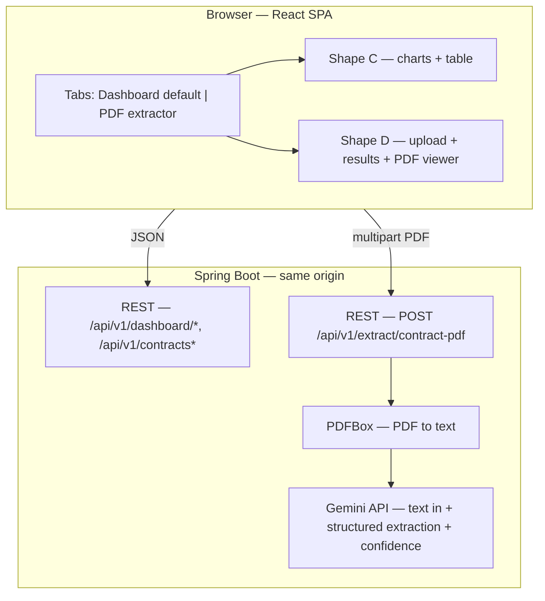

# Shape D — PDF Contract Extractor  
## Technical Design Document (no application code)

**Relationship to Shape C:** Extends the **Contract Expiry Dashboard** (`contract-expiry-dashboard`) with a **second primary view** (tab). The existing Shape C dashboard remains the **default** experience; Shape D adds **demo-only** PDF upload and **AI-assisted** field extraction.  
**Stack (aligned with Shape C):** React, Material UI, Spring Boot REST API; **Apache PDFBox** (or equivalent) on the server for **PDF → text**; **Google Gemini API** (e.g. **Gemini 2.5 Flash**, text-in) for structured field extraction from that text.  
**MVP constraints:** Demo / localhost; **no** persistence of uploaded PDFs or extraction results unless explicitly added later; **no** authentication; advisory-only outputs with mandatory disclaimers (see §3).

---

## 1. Purpose and scope

### 1.1 Purpose

Let procurement staff **upload a contract PDF** and receive **structured fields** extracted with **per-field confidence scores**, shown **beside the original PDF** for quick human review. Reduces time to locate key terms versus scrolling long documents.

### 1.2 Scope (demo MVP)

- **In scope:** Single-PDF upload, **local PDF text extraction** then **Gemini API** structured JSON output, JSON API returning **values + confidence per field**, UI tab with **left panel = extraction**, **right panel = PDF viewer**, confidence **color coding**, **synopsis** truncation + full-text dialog.
- **Out of scope (unless later):** Batch uploads, saving extractions to SQLite, OCR quality guarantees for scanned PDFs, legal certification of accuracy, non-PDF formats.

### 1.3 Integration with Shape C

| Area | Behavior |
|------|----------|
| **Navigation** | App shell gains **tabs** (or equivalent): **“Contract dashboard”** (Shape C) — **default**; **“PDF extractor”** (Shape D). |
| **Data** | Shape C continues to use CSV → SQLite and existing `/api/v1/*` endpoints unchanged unless a shared config object is introduced. Shape D **does not** require contract rows from SQLite for the happy path. |
| **Storyline** | Demo narrative: dashboard for portfolio view (Shape C) → open **PDF extractor** tab when staff need **full agreement text** (Shape D). |

---

## 2. Non-functional requirements

### 2.1 AI and legal disclaimers (mandatory)

- All extracted content is **AI-assisted** and **requires human verification** before reliance.
- **Never** claim legal accuracy; show a short **disclaimer** on the Shape D tab (footer or banner).
- Confidence scores are **model-reported** (see §5.2); they are **not** calibrated probabilities and must be labeled as such in UI copy (e.g. tooltip: “Model confidence estimate — not a statistical guarantee”).

### 2.2 Demo-only posture

- No obligation to retain uploads; implementation may process **in memory** and discard after response.
- File size and page limits should be configurable (e.g. max MB, max pages sent to model) to protect API cost and latency.

---

## 3. Architecture



- **Browser:** One SPA; **tabs** switch between Shape C layout and Shape D layout **without** losing the loaded dashboard state if the implementation keeps both mounted (recommended) or uses session storage — **optional** detail for implementers.
- **Backend:** New endpoint accepts **PDF only**. The server extracts **plain text** with **Apache PDFBox** (or equivalent), then calls **Gemini** `generateContent` with that **text** (not a multimodal PDF attachment) when using **text-only** models (e.g. Gemini 2.5 Flash). Interpretation of fields is done by Gemini; layout-only or **scanned** PDFs may yield little or no text until OCR is added (out of scope for basic MVP).
- **Secrets:** `GEMINI_API_KEY` or `GOOGLE_API_KEY` (Google AI Studio) **only** on server; never exposed to the client.

---

## 4. Extraction model (fields)

Each logical field below is returned by the API with **at minimum** `value` (string or null) and **confidence** (number, **0.0–1.0** inclusive). Optional: `sourceQuote` or `notes` for reviewer context (stretch).

| # | Field name (UI) | API key (suggested) | Notes |
|---|-----------------|---------------------|--------|
| 1 | Agency/Department | `agencyDepartment` | |
| 2 | Contract Number | `contractNumber` | |
| 3 | Contract Value | `contractValue` | Normalize display in UI (currency as string from model) |
| 4 | Supplier | `supplier` | |
| 5 | Procurement Type | `procurementType` | |
| 6 | Description | `description` | |
| 7 | Type of Solicitation | `typeOfSolicitation` | |
| 8 | Effective From | `effectiveFrom` | Prefer ISO date `YYYY-MM-DD` when parseable |
| 9 | Effective To | `effectiveTo` | Prefer ISO date `YYYY-MM-DD` when parseable |
| 10 | Synopsis of the contract | `synopsis` | Long text; UI truncates per §7.3 |

**Display label:** Product copy may use **“Synopsis of the contract”** (or stakeholder spelling **“Synapsis of the contract”**) — the technical field remains `synopsis`.

---

## 5. Google Gemini integration

### 5.1 Approach

1. **Server** receives multipart file **`.pdf`**.
2. **Validate** MIME type and extension; reject non-PDF with `415` or `400`.
3. **Extract text locally** with **Apache PDFBox** (`PDFTextStripper` or equivalent). If no text is extracted (e.g. image-only PDF), return **422** with a clear message unless OCR is added later.
4. **Optional:** Truncate extracted text to a configurable **max character** count for token/cost control; record a **warning** in `meta.warnings` when truncation occurs.
5. **Call Gemini** `generateContent` (`POST .../models/{model}:generateContent?key=...`) with a **single user text part** containing instructions plus the **extracted contract text**. Use **`generationConfig.responseMimeType: application/json`**. Do **not** send raw PDF bytes to text-only models.
6. **Prompting:** Instruct the model that input is **extracted text**, not the original PDF; output **only JSON** matching §6.1; **every field** must include `confidence` between 0 and 1; if unknown, set `value` to `null` and **still** supply `confidence` (e.g. low).
7. **Limits:** Upload size and **max extracted text** length should be configurable. If a request fails or the model cannot produce structured output, return **4xx/5xx** with a clear message.

### 5.2 Confidence scores

- The API response **must** include a **numeric confidence per field** for visualization.
- **Implementation pattern:** Instruct the model to output **self-assessed confidence** (0.0–1.0) per field in JSON. This is **not** native logprob aggregation for structured fields; label it honestly in the UI (§2.1).
- **Optional stretch:** Use **JSON schema** / constrained decoding if the Gemini model and API version support it, to reduce malformed JSON.

### 5.3 Model selection

- Document chosen **model name** in the implementation README. For **text-only** models (e.g. **Gemini 2.5 Flash**), the pipeline must use **PDFBox → text → Gemini**. Multimodal models that accept PDF **`inline_data`** may use a different path; the MVP defaults to **text extraction + `gemini-2.5-flash`** (subject to Google’s quotas).

---

## 6. REST API contract

**Base path:** `/api/v1` (consistent with Shape C).

### 6.1 Response body shape (success)

Suggested JSON (field names may be camelCase to match frontend):

```json
{
  "fields": {
    "agencyDepartment": { "value": "string | null", "confidence": 0.95 },
    "contractNumber": { "value": "string | null", "confidence": 0.88 },
    "contractValue": { "value": "string | null", "confidence": 0.72 },
    "supplier": { "value": "string | null", "confidence": 0.91 },
    "procurementType": { "value": "string | null", "confidence": 0.85 },
    "description": { "value": "string | null", "confidence": 0.80 },
    "typeOfSolicitation": { "value": "string | null", "confidence": 0.77 },
    "effectiveFrom": { "value": "string | null", "confidence": 0.93 },
    "effectiveTo": { "value": "string | null", "confidence": 0.93 },
    "synopsis": { "value": "string | null", "confidence": 0.82 }
  },
  "meta": {
    "model": "string",
    "warnings": ["optional strings e.g. model warnings or unreadable attachment"]
  }
}
```

### 6.2 Endpoint

| Method | Path | Behavior |
|--------|------|----------|
| `POST` | `/api/v1/extract/contract-pdf` | **Body:** `multipart/form-data` with one part `file` (PDF). **Success:** `200` + JSON above. **Errors:** `400` missing file; `415` unsupported media type; `413` payload too large; `422` unprocessable (e.g. no text extracted from PDF, invalid PDF, Gemini blocked output, bad request); `503` **service unavailable** when **no Gemini API key** is configured on the server; `502`/`503` upstream Gemini failure or rate limit. |

### 6.3 CORS / same origin

Same-origin rules as Shape C; no special CORS if SPA is served from the same Spring Boot app.

---

## 7. UI specification (Shape D tab)

### 7.1 Tab bar

| Tab label (suggested) | Content | Default |
|----------------------|---------|---------|
| **Contract dashboard** | Existing Shape C UI (charts, table, dialogs) | **Yes** — selected on load |
| **PDF contract extractor** | Shape D upload + split view | No |

- **App chrome (reference implementation):** Top **AppBar** may use title **Richmond contract tools** with **Tabs** for the two views; **Clear all filters** applies to Shape C and is shown on the dashboard tab only.

### 7.2 PDF extractor tab — upload area

- **Copy (suggested verbiage):** Short instructions, e.g. *Upload a contract PDF to extract key fields using AI. Results are assisted suggestions only — verify against the original document. PDF files only.*
- **Input:** File picker + drag-and-drop (if implemented) restricted to **`.pdf`** and `application/pdf`.
- **Validation:** Client-side: reject non-PDF before upload; show clear error. Server-side: authoritative rejection as in §6.2.
- **Loading:** Disable repeat submit while request in flight; show progress indicator.

### 7.3 Layout

- **Desktop:** Two-column layout: **left** = extraction results; **right** = **PDF viewer** (embed same file uploaded — e.g. object URL or blob URL in browser).
- **Mobile / narrow:** Stack vertically: results **above**, PDF **below** (or collapsible sections); same content order priority.

### 7.4 Left panel — extraction results

- Render each of the **10 fields** in a consistent component: **label**, **value** (or “—” if null), **confidence %** (display `confidence * 100`, rounded for display — e.g. one decimal or integer per design).
- **Color coding (confidence):** Apply to the **row**, **badge**, or **confidence text** — consistent across fields.

| Condition | Color |
|-----------|--------|
| **≥ 90%** | **Green** |
| **≥ 80% and < 90%** | **Yellow** |
| **< 80%** | **Amber** |

- **Synopsis field only:**  
  - Show **first 100 characters** of `value` (if `value` is shorter, show full string).  
  - Provide a **link or button** (e.g. “View full synopsis”) opening a **modal dialog** (or drawer) with **full text** scrollable, **same disclaimer** context as the tab.  
  - If `value` is null, show placeholder and low-confidence styling as usual.

### 7.5 Right panel — PDF viewer

- Use **browser-native** PDF embedding (`<iframe>` + blob URL) or a lightweight viewer (e.g. `react-pdf` / PDF.js) — implementation choice; document in README.
- **Privacy:** Object URLs should be **revoked** when leaving tab or replacing file to avoid leaks in long sessions.

### 7.6 Errors

- Map HTTP errors to **Alert** or inline error: file too large, not PDF, extraction failure, Gemini API error.

---

## 8. Security and configuration

### 8.1 Environment variables (server only)

| Variable | Purpose |
|----------|--------|
| `GEMINI_API_KEY` | Primary; Google AI Studio API key. |
| `GOOGLE_API_KEY` | Alternative env name for the same key (fallback if `GEMINI_API_KEY` is unset). |
| `GEMINI_MODEL` | Optional; overrides default model id (reference default: `gemini-2.5-flash`). |
| `GEMINI_MAX_FILE_BYTES` | Optional; max uploaded PDF size in bytes (reference default ~20MB). |
| `GEMINI_MAX_EXTRACTED_TEXT_CHARS` | Optional; max characters of PDFBox-extracted text sent to Gemini (reference default `800000`); truncation should add a **warning** in `meta.warnings`. |

Never expose API keys to the browser; keys are read only by the Spring Boot process.

### 8.2 Spring Boot properties (`gemini.*`)

| Property | Purpose |
|----------|--------|
| `gemini.api-key` | Resolved from env (`GEMINI_API_KEY` / `GOOGLE_API_KEY`) or overridden by local file / CLI (see §8.3). |
| `gemini.model` | Gemini model id for `:generateContent`. |
| `gemini.max-file-bytes` | Server-side upload guardrail (align with `spring.servlet.multipart.max-file-size`). |
| `gemini.max-extracted-text-chars` | Truncation limit after PDFBox, before Gemini. |

### 8.3 Optional local config and CLI (reference implementation)

- **`spring.config.import`:** `optional:file:./config/gemini-local.yml` — loaded when the file exists (path relative to **process working directory** when starting the JAR).
- **Template:** `config/gemini-local.yml.example` → copy to **`config/gemini-local.yml`** (gitignored) and set `gemini.api-key` for local dev without exporting env vars.
- **CLI:** `--gemini.api-key=...` may override properties when starting the application.

### 8.4 Limits summary

| Limit | Purpose |
|-------|--------|
| Spring multipart max file size | Must be ≥ `gemini.max-file-bytes` intent; reject oversize before PDFBox. |
| PDFBox extraction | Image-only / scanned PDFs may yield **no text** → **422** (OCR out of scope for basic MVP). |
| Max extracted text chars | Protects token cost and request size to Gemini; truncate with user-visible warning. |

---

## 9. Testing notes (lightweight for demo)

- **Unit:** PDF magic-byte / extension validation; response JSON mapping to DTOs; **Gemini** response text extraction (`candidates[0].content.parts[0].text`); markdown-fence stripping on model output; confidence → color bucket helper (90/80 boundaries) on the frontend.
- **Manual:** Upload sample PDF from `procurement-examples/pdfs/`; verify PDFBox produces text, Gemini returns JSON, all **10 fields** render, synopsis **100-character** truncation + **View full synopsis** dialog, blob URL PDF preview, disclaimers, and error mapping (`503` without API key, `422` when no extractable text).

---

## 10. Implementation reference

- **Module / repository path:** `pillar-thriving-city-hall/contract-expiry-dashboard/` (single fat JAR: React static assets + Spring Boot).
- **Backend:** Java **17+**, Spring Boot **3.x**; **Apache PDFBox 3.x** (`PDFTextStripper` / `Loader.loadPDF`); **RestTemplate** to `generativelanguage.googleapis.com` for `generateContent`.
- **Frontend:** React + Vite + Material UI; tabbed shell shared with Shape C; `extractContractPdf` → `POST /api/v1/extract/contract-pdf`.
- **Docs:** Operational details and env examples: `contract-expiry-dashboard/README.md`.

---

## 11. Traceability

- Shape definition: `04_build_guides/01_mvp_shapes.md` (Shape D).
- Parent TDD: `07_mvp_doc/shape_c_contract_expiry_dashboard_tdd.md`.
- Sample assets: `procurement-examples/pdfs/` (primary); `procurement-examples/txt/` optional reference only — **not** used by the automated Shape D pipeline (PDFBox + Gemini).

---

*Document version: 1.4 — Consolidated implementation: PDFBox → text → Gemini 2.5 Flash (`generateContent`, JSON response); config (`gemini.*`, env, optional `config/gemini-local.yml`, CLI); 503/422 semantics; app chrome + tabs; §10 implementation reference; README alignment.*
